# Database Initialization (`db-init`)

## Scopo del Servizio
La cartella `db-init` contiene gli script SQL necessari per l'inizializzazione del database PostgreSQL al suo primo avvio. L'obiettivo è quello di creare automaticamente lo schema del database (tabelle, tipi custom, indici, viste) e popolare eventuali dati essenziali non appena il container del database viene avviato per la prima volta.

## Struttura delle Cartelle
- **`database.sql`**: È lo script SQL principale. Contiene tutte le definizioni DDL (Data Definition Language) per creare l'architettura relazionale del progetto PWM (Prova Web Mobile). 

## Configurazione Docker
Nel file `docker-compose.yml`, questa cartella è montata direttamente all'interno del container PostgreSQL (`db`):

```yaml
  db:
    image: postgres:15-alpine
    ...
    volumes:
      - ./db-init:/docker-entrypoint-initdb.d  # Esegue automaticamente gli script SQL
      - postgres_data:/var/lib/postgresql/data
```

L'immagine ufficiale di PostgreSQL è programmata per eseguire in automatico qualsiasi script `.sql` o `.sh` che si trova nella cartella interna `/docker-entrypoint-initdb.d/`, ma **soltanto se la cartella dati del database è vuota** (quindi al primissimo avvio del volume `postgres_data`).

## Note
- **Modifiche successive**: Se aggiungi nuove tabelle o modifichi `database.sql` dopo che il container è già stato avviato, tali modifiche **non** verranno eseguite in automatico al riavvio del container. Sarà necessario eliminare il volume (es. `docker-compose down -v`) per forzare una nuova inizializzazione o applicare le modifiche manualmente.

## Schema E-R
Di seguito lo schema Entity-Relationship mappato esattamente da `database.sql`.

```mermaid
erDiagram
    %% 1. UTENTI
    utenti {
        UUID id_user PK "DEFAULT uuid_generate_v4()"
        VARCHAR(32) username "NOT NULL UNIQUE"
        VARCHAR(64) email "NOT NULL UNIQUE"
        TEXT password_hash "NOT NULL"
        VARCHAR(32) reg
        INT elo_rating "DEFAULT 1000"
        SMALLINT avatar_id "DEFAULT 1"
        TIMESTAMP last_username_change "NULL DEFAULT NULL"
        TIMESTAMP last_password_change "NULL DEFAULT NULL"
        TIMESTAMP created_at "DEFAULT CURRENT_TIMESTAMP"
        VARCHAR(8) recupera_passwd_token_link "DEFAULT NULL"
        BIT(3) two_fa_method "DEFAULT B'000'"
        VARCHAR(8) two_fa_secret "DEFAULT NULL"
        BOOLEAN two_fa_enabled "DEFAULT FALSE"
        BOOLEAN is_banned "DEFAULT FALSE"
        BOOLEAN is_perma_banned "DEFAULT FALSE"
        VARCHAR(10) codice_amico "UNIQUE DEFAULT uuid_generate_v4()"
    }
    
    richieste_amici {
        UUID id_request PK "DEFAULT uuid_generate_v4()"
        UUID id_user FK "NOT NULL"
        UUID id_target FK "NOT NULL"
        status_amico status "DEFAULT 'pending'"
        VARCHAR(10) link "DEFAULT NULL"
        INT link_duration "DEFAULT NULL"
        TIMESTAMP created_at "DEFAULT CURRENT_TIMESTAMP"
        TIMESTAMP accepted_at "NULL"
    }

    amici {
        UUID id_user PK,FK "NOT NULL"
        UUID id_amico PK,FK "NOT NULL"
        UUID id_request FK "UNIQUE"
        TIMESTAMP created_at "DEFAULT CURRENT_TIMESTAMP"
    }

    ban {
        UUID id_ban PK "DEFAULT uuid_generate_v4()"
        UUID id_user FK "NOT NULL"
        TIMESTAMP time_stamp "DEFAULT CURRENT_TIMESTAMP"
        TIMESTAMP time_until "NOT NULL"
        VARCHAR(20) motivo "NOT NULL"
    }

    obiettivi {
        UUID id_obbiettivo PK "DEFAULT uuid_generate_v4()"
        VARCHAR(32) nome_obbiettivo "NOT NULL"
        TEXT descrizione
        TEXT requisito
        TEXT ricompensa
        TIMESTAMP created_at "DEFAULT CURRENT_TIMESTAMP"
    }

    obiettivi_utente {
        UUID id_obbiettivo_utente PK "DEFAULT uuid_generate_v4()"
        UUID id_user FK "NOT NULL"
        UUID id_obbiettivo FK "NOT NULL"
        VARCHAR(20) stato "DEFAULT 'incompleto'"
        REAL progress "DEFAULT 0.00"
        TIMESTAMP updated_at "DEFAULT CURRENT_TIMESTAMP"
    }

    accessi {
        UUID id_access PK "DEFAULT uuid_generate_v4()"
        UUID user_id FK "NOT NULL"
        VARCHAR(45) ip_address
        TIMESTAMP login_time "DEFAULT CURRENT_TIMESTAMP"
        VARCHAR(255) cookie_token
        TIMESTAMP expire_time
    }

    password_recovery_tokens {
        VARCHAR(64) token PK
        UUID id_user FK "NOT NULL"
        TIMESTAMP expire_time "NOT NULL"
        TIMESTAMP created_at "DEFAULT CURRENT_TIMESTAMP"
    }

    %% 3. PARTITE
    partite {
        UUID id_partita PK "DEFAULT uuid_generate_v4()"
        VARCHAR(10) id_partita_visualizzato "UNIQUE"
        VARCHAR(255) id_partita_hash
        VARCHAR(100) nome_partita "NOT NULL"
        BOOLEAN has_elo "DEFAULT TRUE"
        UUID id_host FK "NOT NULL"
        BIT(56) struttura_partita "DEFAULT B'000...'"
        INT max_partecipants_alleances "DEFAULT 2"
        TIMESTAMP tempo_start "NOT NULL DEFAULT CURRENT_TIMESTAMP"
        TIMESTAMP created_at "DEFAULT CURRENT_TIMESTAMP"
    }

    partecipanti_partite {
        UUID user_id PK,FK "NOT NULL"
        UUID partita_id PK,FK "NOT NULL"
        BIT(3) stato "DEFAULT B'000'"
        INT nuovo_ELO
        INT punteggio "DEFAULT 0"
        INT territori_conquistati "DEFAULT 0"
        INT territori_persi "DEFAULT 0"
        INT capitali_distrutte "DEFAULT 0"
        TIMESTAMP time_death "NULL DEFAULT NULL"
        INT rank "DEFAULT NULL"
        INT strutture_lvl_max "DEFAULT 0"
        INT truppe_eliminate "DEFAULT 0"
        INT truppe_perse "DEFAULT 0"
        REAL perc_distruzione "DEFAULT 0.0"
        UUID id_alleanza "NULL"
        TIMESTAMP joined_at "DEFAULT CURRENT_TIMESTAMP"
        TIMESTAMP abbandono_alleanza_at "NULL DEFAULT NULL"
        JSONB utenti_alleati "DEFAULT '{}'::jsonb"
        JSONB utenti_in_guerra "DEFAULT '{}'::jsonb"
        JSONB stato_risorse "DEFAULT '{}'::jsonb"
        JSONB stato_territori "DEFAULT '{}'::jsonb"
        JSONB stato_ricerche "DEFAULT '{}'::jsonb"
        JSONB stato_strutture "DEFAULT '{}'::jsonb"
    }

    storico_partecipanti_partite {
        UUID user_id PK,FK "NOT NULL"
        UUID partita_id PK,FK "NOT NULL"
        INT nuovo_ELO
        INT punteggio "DEFAULT 0"
        INT territori_conquistati "DEFAULT 0"
        INT territori_persi "DEFAULT 0"
        INT capitali_distrutte "DEFAULT 0"
        TIMESTAMP time_death "NULL DEFAULT NULL"
        INT rank "DEFAULT NULL"
        INT strutture_lvl_max "DEFAULT 0"
        INT truppe_eliminate "DEFAULT 0"
        INT truppe_perse "DEFAULT 0"
        REAL perc_distruzione "DEFAULT 0.0"
        UUID id_alleanza "DEFAULT NULL"
        TIMESTAMP joined_at "DEFAULT CURRENT_TIMESTAMP"
        TIMESTAMP abbandono_alleanza_at "NULL DEFAULT NULL"
    }

    %% 5. MOSSE E STORICO
    mosse {
        UUID id_mossa PK "DEFAULT uuid_generate_v4()"
        UUID user_id FK "NOT NULL"
        UUID partita_id FK "NOT NULL"
        BOOLEAN automatic_move "DEFAULT FALSE"
        VARCHAR(16) type_action "NOT NULL"
        UUID id_truppa FK "DEFAULT NULL"
        UUID id_armata FK "DEFAULT NULL"
        VARCHAR(10) id_territorio_conquista "DEFAULT NULL"
        INT queue_order
        TIMESTAMP ttl "DEFAULT now()"
        VARCHAR(2) priorita "DEFAULT '00'"
        TIMESTAMP created_at "DEFAULT CURRENT_TIMESTAMP"
    }

    storico {
        SERIAL id_mossa PK
        UUID user_id FK "NOT NULL"
        UUID partita_id FK "NOT NULL"
        VARCHAR(16) type_action "NOT NULL"
        VARCHAR(64) descrizione "NOT NULL"
    }

    spostamenti {
        UUID id_spostamento PK "DEFAULT uuid_generate_v4()"
        UUID id_mossa FK "NOT NULL"
        INT numero_coda
        REAL x_dest
        REAL y_dest
        VARCHAR(128) target_node
        TIMESTAMP time_to_arrive
    }

    alleanze {
        UUID id_alleanza PK "DEFAULT uuid_generate_v4()"
        VARCHAR(32) nome_alleanza "NOT NULL"
        TIMESTAMP created_at "DEFAULT CURRENT_TIMESTAMP"
        VARCHAR(16) nome_logo
        UUID id_leader FK "NOT NULL"
        UUID id_partita FK "NOT NULL"
        INT max_membri "NOT NULL DEFAULT 4"
    }

    messaggi {
        UUID id_mex PK "DEFAULT uuid_generate_v4()"
        UUID id_user_send FK "NOT NULL"
        UUID id_partita FK "NOT NULL"
        TEXT content "NOT NULL"
        TIMESTAMP time_stamp "DEFAULT CURRENT_TIMESTAMP"
    }

    chat {
        BIGINT id_chat_entry PK "GENERATED ALWAYS AS IDENTITY"
        UUID id_mex FK "NOT NULL UNIQUE"
        UUID id_user_receiver FK "NULL"
        VARCHAR(20) tipo_chat
    }

    truppe {
        UUID id_istanza_truppa PK "DEFAULT uuid_generate_v4()"
        UUID partita_id FK "NOT NULL"
        UUID user_id FK "NOT NULL"
        VARCHAR(16) id_modello
        UUID id_armata FK
        REAL x
        REAL y
        REAL alt "DEFAULT 0"
        REAL rot "DEFAULT 0"
        INT hp
        BIT(3) stato "DEFAULT B'000'"
        BIT(3) attitudine "DEFAULT B'000'"
        TIMESTAMP last_update "DEFAULT CURRENT_TIMESTAMP"
    }

    armata {
        UUID id_istanza_armata PK "DEFAULT uuid_generate_v4()"
        UUID partita_id FK "NOT NULL"
        UUID user_id FK "NOT NULL"
        VARCHAR(16) id_modello
        REAL x
        REAL y
        REAL alt "DEFAULT 0"
        REAL rot "DEFAULT 0"
        INT hp_tot
        BIT(3) stato "DEFAULT B'000'"
        BIT(3) attitudine "DEFAULT B'000'"
        INT max_range_atck
        INT dmg_tot
        REAL speed
        INT tipo_armata
        BOOLEAN are_they_in_the_same_position "DEFAULT TRUE"
        TIMESTAMP last_update "DEFAULT CURRENT_TIMESTAMP"
    }

    attacco {
        UUID id_attacco PK "DEFAULT uuid_generate_v4()"
        UUID id_mossa FK "NOT NULL"
        UUID partita_id FK "NOT NULL"
        UUID id_attaccante "NOT NULL"
        UUID id_target_truppa "DEFAULT NULL"
        UUID id_target_armata "DEFAULT NULL"
        VARCHAR(128) id_target_citta "DEFAULT NULL"
        TIMESTAMP time_stamp "DEFAULT CURRENT_TIMESTAMP"
        TIMESTAMP next_round_time "NOT NULL"
        VARCHAR(20) status "DEFAULT 'active'"
    }

    %% RELAZIONI ESATTE DA FK
    utenti ||--o{ richieste_amici : "invia (fk_user_richieste)"
    utenti ||--o{ richieste_amici : "riceve (fk_target_richieste)"
    utenti ||--o{ amici : "è amico (fk_user_amici)"
    utenti ||--o{ amici : "ha amico (fk_target_amici)"
    richieste_amici ||--o| amici : "fk_request_origin"
    
    utenti ||--o{ ban : "fk_user_ban"
    utenti ||--o{ obiettivi_utente : "fk_user_obbiettivo"
    obiettivi ||--o{ obiettivi_utente : "fk_obbiettivo"
    
    utenti ||--o{ accessi : "fk_user_accessi"
    utenti ||--o{ password_recovery_tokens : "fk_password_recovery_username"
    
    utenti ||--o{ partite : "fk_host"
    
    utenti ||--o{ partecipanti_partite : "fk_user_partecipante"
    partite ||--o{ partecipanti_partite : "fk_partita_partecipante"

    utenti ||--o{ storico_partecipanti_partite : "fk_user_partecipante"
    partite ||--o{ storico_partecipanti_partite : "fk_partita_partecipante"

    partecipanti_partite ||--o{ mosse : "fk_mossa_owner (user_id, partita_id)"
    
    truppe ||--o{ mosse : "fk_spostamento_truppa"
    armata ||--o{ mosse : "fk_spostamento_armata"
    
    partecipanti_partite ||--o{ storico : "fk_mossa_owner (user_id, partita_id)"
    
    mosse ||--o{ spostamenti : "fk_spostamento_mossa"
    
    utenti ||--o{ alleanze : "fk_leader"
    partite ||--o{ alleanze : "fk_partita_alleanza"
    
    partecipanti_partite ||--o{ messaggi : "fk_messaggio_autore (id_user_send, id_partita)"
    
    messaggi ||--o| chat : "fk_chat_mex"
    utenti ||--o{ chat : "fk_chat_receiver"
    
    partecipanti_partite ||--o{ truppe : "fk_truppa_owner (user_id, partita_id)"
    partecipanti_partite ||--o{ armata : "fk_armata_owner (user_id, partita_id)"
    
    armata ||--o{ truppe : "fk_truppa_armata"
    
    mosse ||--o{ attacco : "fk_attacco_mossa"
    partite ||--o{ attacco : "fk_attacco_partita"
```

<details>
<summary>Clicca qui per espandere lo schema ER completo</summary>


</details>
