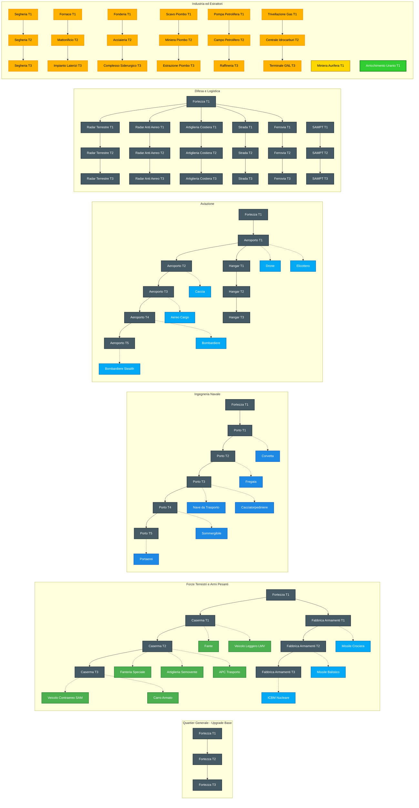

# Albero Tecnologico Globale - Tactical Command

```mermaid
graph LR
    %% STILI COLORI
    classDef terra fill:#4CAF50,stroke:#2E7D32,stroke-width:2px,color:#fff;
    classDef mare fill:#1E88E5,stroke:#1565C0,stroke-width:2px,color:#fff;
    classDef aria fill:#03A9F4,stroke:#0277BD,stroke-width:2px,color:#fff;
    classDef struttura fill:#455A64,stroke:#263238,stroke-width:2px,color:#fff;
    classDef risorsa fill:#FFB300,stroke:#F39C12,stroke-width:2px,color:#000;
    classDef premium fill:#FFD700,stroke:#B8860B,stroke-width:2px,color:#000;
    classDef nucleare fill:#32CD32,stroke:#006400,stroke-width:2px,color:#fff;

    %% CENTRO COMANDO (Progressione pura)
    subgraph HQ [Quartier Generale - Upgrade Base]
        HQ_F1[Fortezza T1]:::struttura --> HQ_F2[Fortezza T2]:::struttura --> HQ_F3[Fortezza T3]:::struttura
    end

    %% ESERCITO
    subgraph Terrestre [Forze Terrestri e Armi Pesanti]
        F_Terr[Fortezza T1]:::struttura --> C1[Caserma T1]:::struttura
        F_Terr --> FA1[Fabbrica Armamenti T1]:::struttura
        
        C1 --> C2[Caserma T2]:::struttura --> C3[Caserma T3]:::struttura
        
        C1 -.-> T_Fante[Fante]:::terra
        C1 -.-> T_LMV[Veicolo Leggero LMV]:::terra
        
        C2 -.-> T_Spec[Fanteria Speciale]:::terra
        C2 -.-> T_Art[Artiglieria Semovente]:::terra
        C2 -.-> T_APC[APC Trasporto]:::terra
        
        C3 -.-> T_SAM[Veicolo Contraereo SAM]:::terra
        C3 -.-> T_Carro[Carro Armato]:::terra
        
        FA1 --> FA2[Fabbrica Armamenti T2]:::struttura --> FA3[Fabbrica Armamenti T3]:::struttura
        
        FA1 -.-> M_Crociera[Missile Crociera]:::aria
        FA2 -.-> M_Balistico[Missile Balistico]:::aria
        FA3 -.-> M_ICBM[ICBM Nucleare]:::aria
    end

    %% MARINA
    subgraph Marina [Ingegneria Navale]
        F_Mar[Fortezza T1]:::struttura --> P1[Porto T1]:::struttura
        
        P1 --> P2[Porto T2]:::struttura --> P3[Porto T3]:::struttura --> P4[Porto T4]:::struttura --> P5[Porto T5]:::struttura
        
        P1 -.-> N_Corvetta[Corvetta]:::mare
        P2 -.-> N_Fregata[Fregata]:::mare
        P3 -.-> N_Cargo[Nave da Trasporto]:::mare
        P3 -.-> N_Caccia[Cacciatorpediniere]:::mare
        P4 -.-> N_Sub[Sommergibile]:::mare
        P5 -.-> N_Portaerei[Portaerei]:::mare
    end

    %% AERONAUTICA
    subgraph Aeronautica [Aviazione]
        F_Aero[Fortezza T1]:::struttura --> A1[Aeroporto T1]:::struttura
        
        A1 --> A2[Aeroporto T2]:::struttura --> A3[Aeroporto T3]:::struttura --> A4[Aeroporto T4]:::struttura --> A5[Aeroporto T5]:::struttura
        
        A1 --> H1[Hangar T1]:::struttura
        H1 --> H2[Hangar T2]:::struttura
        H2 --> H3[Hangar T3]:::struttura

        A1 -.-> V_Drone[Drone]:::aria
        A1 -.-> V_Elicottero[Elicottero]:::aria
        A2 -.-> V_Caccia[Caccia]:::aria
        A3 -.-> V_Cargo[Aereo Cargo]:::aria
        A4 -.-> V_Bombardiere[Bombardiere]:::aria
        A5 -.-> V_Stealth[Bombardiere Stealth]:::aria
    end

    %% DIFESE E INFRASTRUTTURE
    subgraph Logistica [Difesa e Logistica]
        F_Log[Fortezza T1]:::struttura --> R1[Radar Terrestre T1]:::struttura
        F_Log --> RA1[Radar Anti Aereo T1]:::struttura
        F_Log --> AC1[Artiglieria Costiera T1]:::struttura
        F_Log --> S1[Strada T1]:::struttura
        F_Log --> FE1[Ferrovia T1]:::struttura

        R1 --> R2[Radar Terrestre T2]:::struttura --> R3[Radar Terrestre T3]:::struttura
        RA1 --> RA2[Radar Anti Aereo T2]:::struttura --> RA3[Radar Anti Aereo T3]:::struttura
        AC1 --> AC2[Artiglieria Costiera T2]:::struttura --> AC3[Artiglieria Costiera T3]:::struttura
        S1 --> S2[Strada T2]:::struttura --> S3[Strada T3]:::struttura
        FE1 --> FE2[Ferrovia T2]:::struttura --> FE3[Ferrovia T3]:::struttura
        
        %% SAMPT è collegato internamente alla logistica (richiederebbe Fabbrica T1 da DB, ma lo teniamo lineare qui)
        S_SAM1[SAMPT T1]:::struttura --> S_SAM2[SAMPT T2]:::struttura --> S_SAM3[SAMPT T3]:::struttura
    end

    %% ECONOMIA
    subgraph Economia [Industria ed Estrattori]
        L1[Segheria T1]:::risorsa --> L2[Segheria T2]:::risorsa --> L3[Segheria T3]:::risorsa
        M1[Fornace T1]:::risorsa --> M2[Mattonificio T2]:::risorsa --> M3[Impianto Laterizi T3]:::risorsa
        E_A1[Fonderia T1]:::risorsa --> E_A2[Acciaieria T2]:::risorsa --> E_A3[Complesso Siderurgico T3]:::risorsa
        E_P1[Scavo Piombo T1]:::risorsa --> E_P2[Miniera Piombo T2]:::risorsa --> E_P3[Estrazione Piombo T3]:::risorsa
        E_PE1[Pompa Petrolifera T1]:::risorsa --> E_PE2[Campo Petrolifero T2]:::risorsa --> E_PE3[Raffineria T3]:::risorsa
        E_G1[Trivellazione Gas T1]:::risorsa --> E_G2[Centrale Idrocarburi T2]:::risorsa --> E_G3[Terminale GNL T3]:::risorsa
        
        E_O1[Miniera Aurifera T1]:::premium
        E_U1[Arricchimento Uranio T1]:::nucleare
    end
```